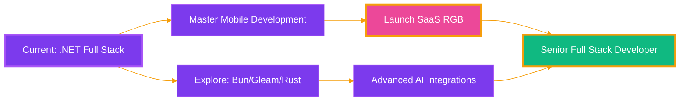

<div align="center">

<!-- ANIMATED HEADER WITH GRADIENT -->


<!-- TYPING ANIMATION BIO -->
<div align="center">
  
</div>

### 🌐 Versão em Português 🖱️ 
<a href="./README.pt-BR.md">
  
</a>

<!-- BADGES ROW 1 - SOCIAL & STATUS -->
<p align="center">
  <a href="https://github.com/Joao-Crivoi">
    
  </a>
  <a href="https://www.linkedin.com/in/joao-crivoi-souza">
    
  </a>
  
  
</p>

<!-- BADGES ROW 2 - AVAILABILITY -->
<p align="center">
  
  
  
</p>

---

### 🎯 About Me

```typescript
const developer = {
    name: "João",
    role: "Junior Full Stack Developer",
    location: "Praia Grande / São Paulo, Brazil",
    
    experience: {
        professional: "1 year (Freelancer + Volunteer + Internship)",
        education: "7 years (Technical + Academic + Courses + Achievements)"
    },
    
    focus: [".NET Ecosystem", "Full Stack", "Future: Mobile Development"],
    
    hobbies: ["Game Dev with Unity", "AI Integrations", "React/TypeScript Projects"],
    
    currentlyExploring: ["Bun", "Gleam", "Rust", "Nim", "Mojo"],
    
    secretProject: "🌈 SaaS RGB (Coming Soon...)"
};
```

---

## 🏆 Achievements & Awards

<table align="center">
  <tr>
    <td align="center" width="50%">
      
      <br/>
      <b>AI-Powered Job Matching Agent</b>
      <br/>
      <sub>WhatsApp automation for port industry recruitment</sub>
      <br/>
      
      
      
    </td>
    <td align="center" width="50%">
      
      <br/>
      <b>Intelligent Port Chatbot</b>
      <br/>
      <sub>Vessel arrival predictions via 10 official APIs</sub>
      <br/>
      
      
      
    </td>
  </tr>
</table>

---

## 🛠️ Tech Stack

<div align="center">

### 🎯 Primary Focus (.NET Ecosystem)

<p>
  
  
  
</p>

### 💻 Languages & Frameworks

<p>
  
  
  
  
  
</p>

### 🎨 Frontend

<p>
  
  
  
  
</p>

### 🗄️ Databases

<p>
  
  
  
</p>

### 🔧 DevOps & Tools

<p>
  
  
  
</p>

### 🎮 Hobby Stack

<p>
  
  
  
</p>

### 🚀 Currently Exploring

<p>
  
  
  
  
  
</p>

</div>

---

## 🌟 Featured Projects

<div align="center">

<table>
  <tr>
    <td width="50%" valign="top">
      <h3 align="center">🌈 SaaS RGB</h3>
      <div align="center">
        
        <br/><br/>
        <p><b>Secret SaaS Project</b></p>
        <p>Currently in the ideation and maturation phase. Full-stack platform leveraging modern technologies for innovative solutions.</p>
        <p>
            
            
            
            
        </p>
      </div>
    </td>
    <td width="50%" valign="top">
      <h3 align="center">🤖 AI Job Matcher</h3>
      <div align="center">
        
        <br/><br/>
        <p><b>ExplogHack 2025 - 2nd Place</b></p>
        <p>WhatsApp automation agent using AI for intelligent job matching in the port logistics industry.</p>
        <p>
          
          
          
        </p>
      </div>
    </td>
  </tr>
  <tr>
    <td width="50%" valign="top">
      <h3 align="center">⚓ Port Intelligence Bot</h3>
      <div align="center">
        
        <br/><br/>
        <p><b>PortoHackSantos 2025 - 3rd Place</b></p>
        <p>Intelligent chatbot consuming 10 official Port of Santos APIs to predict vessel arrivals and optimize logistics.</p>
        <p>
          
          
          
        </p>
      </div>
    </td>
    <td width="50%" valign="top">
      <h3 align="center">🎮 Unity Game Projects</h3>
      <div align="center">
        
        <br/><br/>
        <p><b>Game Development Experiments</b></p>
        <p>Personal game development projects exploring Unity engine, game mechanics, and interactive experiences.</p>
        <p>
          
          
        </p>
      </div>
    </td>
  </tr>
</table>

</div>

---

## 📊 GitHub Stats

<div align="center">
  
  
</div>

<div align="center">
  
</div>

---

## 🎓 Education

<div align="center">

| 🎓 Degree | 🏫 Institution | 📅 Year | 🏆 Highlight |
|:---:|:---:|:---:|:---:|
| **Systems Analysis & Development** | Instituto Federal de São Paulo (IFSP) | 2025 | 2x National Hackathon Awards |
| **Technical High School** | Instituto Federal do Maranhão (IFMA) | 2019 | Freelancer + Course Mentor |

</div>

---

## 🗺️ Roadmap & Goals



### 🎯 Short-term Goals (2025)
- 📱 Start **Mobile Development** journey (React Native / .NET MAUI)
- 🦀 Deep dive into **Rust** for performance-critical applications

### 🌟 Long-term Vision
- Become a **Senior Full Stack Developer** specialized in .NET
- 🚀 Launch **SaaS RGB** MVP
- 🎮 Release first **Unity game** project
- Contribute to **open-source** projects in .NET ecosystem
- Mentor **junior developers** in the community

---

## 📫 Let's Connect!

<div align="center">

<p>
  <a href="https://www.linkedin.com/in/joao-crivoi-souza">
    
  </a>
  <a href="mailto:joaocrivoi13@gmail">
    
  </a>
  <a href="https://github.com/Joao-Crivoi">
    
  </a>
</p>

### 💼 Open to Opportunities

- 🌍 **Remote** - Worldwide
- 🏢 **On-Site / Hybrid** - São Paulo, SP, Brazil
- 🎯 **Looking for** - Full Stack Developer roles (Junior/Mid-level)
- 💡 **Specialization** - .NET Ecosystem, React, Vue.js, TypeScript

---

<p align="center">
  
</p>


<!-- ANIMATED FOOTER -->


</div>
