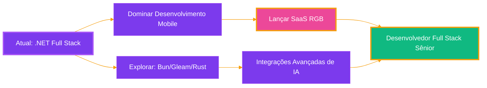

<div align="center">

<!-- FOOTER ANIMADO -->


<!-- HEADER ANIMADO COM GRADIENTE -->


<!-- ANIMAÇÃO DE DIGITAÇÃO BIO -->
<div align="center">
  
</div>

<a href="./README.md">
  
</a>

<p align="center">
  
</p>

---

<!-- BADGES LINHA 1 - SOCIAL & STATUS -->
<p align="center">
  <a href="https://github.com/Joao-Crivoi">
    
  </a>
  <a href="https://linkedin.com/in/joao-crivoi-souza">
    
  </a>
  
  
</p>

<!-- BADGES LINHA 2 - DISPONIBILIDADE -->
<p align="center">
  
  
  
</p>

---

### 🎯 Sobre Mim

```typescript
const desenvolvedor = {
    nome: "João",
    cargo: "Desenvolvedor Full Stack Júnior",
    localização: "Praia Grande / São Paulo, Brasil",
    
    experiencia: {
        profissional: "1 ano (Freelancer + Voluntário + Estágio)",
        educacao: "7 anos (Técnico + Graduação + Cursos + Conquistas)"
    },
    
    foco: ["Ecossistema .NET", "Full Stack", "Futuro: Desenvolvimento Mobile"],
    
    hobbies: ["Game Dev com Unity", "Integrações com IA", "Projetos com Bun, Gleam, Rust, Nim e Mojo"],
    
    explorandoAtualmente: ["Bun", "Gleam", "Rust", "Nim", "Mojo"],
    
    projetoSecreto: "🌈 SaaS RGB (Em breve...)"
};
```

---

## 🏆 Conquistas & Prêmios

<table align="center">
  <tr>
    <td align="center" width="50%">
      
      <br/>
      <b>Agente IA para Matching de Vagas</b>
      <br/>
      <sub>Automação WhatsApp para recrutamento portuário</sub>
      <br/>
      
      
      
    </td>
    <td align="center" width="50%">
      
      <br/>
      <b>Chatbot Inteligente Portuário</b>
      <br/>
      <sub>Predição de chegada de navios via 10 APIs oficiais</sub>
      <br/>
      
      
      
    </td>
  </tr>
</table>

---

## 🛠️ Stack Tecnológica

<div align="center">

### 🎯 Foco Principal (Ecossistema .NET)

<p>
  
  
  
</p>

### 💻 Linguagens & Frameworks

<p>
  
  
  
  
  
</p>

### 🎨 Frontend

<p>
  
  
  
  
</p>

### 🗄️ Bancos de Dados

<p>
  
  
  
</p>

### 🔧 DevOps & Ferramentas

<p>
  
  
  
</p>

### 🎮 Stack de Hobbies

<p>
  
  
  
</p>

### 🚀 Explorando Atualmente

<p>
  
  
  
  
  
</p>

</div>

---

## 🌟 Projetos em Destaque

<div align="center">

<table>
  <tr>
    <td width="50%" valign="top">
      <h3 align="center">🌈 SaaS RGBm</h3>
      <div align="center">
        
        <br/><br/>
        <p><b>Projeto SaaS Secreto</b></p>
        <p>Atualmente na fase de idealização e amadurecimento. Plataforma full-stack aproveitando tecnologias modernas para soluções inovadoras.</p>
        <p>
            
            
            
            
        </p>
      </div>
    </td>
    <td width="50%" valign="top">
      <h3 align="center">🤖 AI Job Matcher</h3>
      <div align="center">
        
        <br/><br/>
        <p><b>ExplogHack 2025 - 2º Lugar</b></p>
        <p>Agente de automação WhatsApp usando IA para matching inteligente de vagas na indústria de logística portuária.</p>
        <p>
          
          
          
        </p>
      </div>
    </td>
  </tr>
  <tr>
    <td width="50%" valign="top">
      <h3 align="center">⚓ Bot Inteligência Portuária</h3>
      <div align="center">
        
        <br/><br/>
        <p><b>PortoHackSantos 2025 - 3º Lugar</b></p>
        <p>Chatbot inteligente consumindo 10 APIs oficiais do Porto de Santos para prever chegada de navios e otimizar logística.</p>
        <p>
          
          
          
        </p>
      </div>
    </td>
    <td width="50%" valign="top">
      <h3 align="center">🎮 Projetos Unity</h3>
      <div align="center">
        
        <br/><br/>
        <p><b>Experimentos de Game Dev</b></p>
        <p>Projetos pessoais de desenvolvimento de jogos explorando Unity engine, mecânicas de jogo e experiências interativas.</p>
        <p>
          
          
        </p>
      </div>
    </td>
  </tr>
</table>

</div>

---

## 📊 Estatísticas GitHub

<div align="center">
  
  
</div>

<div align="center">
  
</div>

---

## 🎓 Educação

<div align="center">

| 🎓 Formação | 🏫 Instituição | 📅 Ano | 🏆 Destaque |
|:---:|:---:|:---:|:---:|
| **Análise e Desenvolvimento de Sistemas** | Instituto Federal de São Paulo (IFSP) | 2025 | 2x Prêmios em Hackathons Nacionais |
| **Ensino Médio Técnico** | Instituto Federal do Maranhão (IFMA) | 2019 | Projeto Freelancer + Mentor de Reforço do Curso |

</div>

---

## 🗺️ Roadmap & Objetivos



### 🎯 Objetivos de Curto Prazo (2025)
- 📱 Iniciar jornada de **Desenvolvimento Mobile** (React Native / .NET MAUI)
- 🦀 Mergulhar em **Rust** para aplicações críticas de performance


### 🌟 Visão de Longo Prazo
- Tornar-me **Desenvolvedor Full Stack Sênior** especializado em .NET
- Lançar MVP do **SaaS RGB**
- Contribuir para projetos **open-source** no ecossistema .NET
- Mentorar **desenvolvedores júnior** na comunidade
- 🎮 Lançar primeiro projeto de **jogo Unity**
---

## 📫 Vamos Conectar!

<div align="center">

<p>
  <a href="https://linkedin.com/in/joao-crivoi-souza">
    
  </a>
  <a href="mailto:joaocrivoi13@gmail.com">
    
  </a>
  <a href="https://github.com/Joao-Crivoi">
    
  </a>
</p>

### 💼 Aberto a Oportunidades

- 🌍 **Remoto** - Mundial
- 🏢 **Presencial / Híbrido** - São Paulo, SP, Brasil
- 🎯 **Buscando** - Vagas de Desenvolvedor Full Stack (Júnior/Pleno)
- 💡 **Especialização** - Ecossistema .NET, React, Vue.js, TypeScript


<!-- FOOTER ANIMADO -->


</div>
